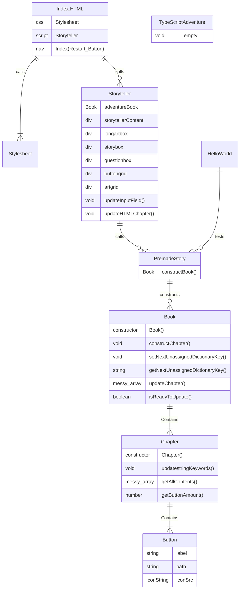

```mermaid
erDiagram
    Book ||--|{Chapter:Contains
    Chapter ||--|{Button:Contains
    Button
    Index.HTML ||--|{Stylesheet:calls
    Index.HTML ||--o{Storyteller: calls
    Stylesheet 
    PremadeStory ||--o{Book: constructs
    Storyteller ||--o{PremadeStory: calls

    HelloWorld ||--o{PremadeStory: tests

    TypeScriptAdventure{
        void empty
    }

    Index.HTML{
        css Stylesheet
        script Storyteller
        nav Index(Restart_Button)
    }

    Storyteller{
        Book adventureBook
        div storytellerContent
        div longartbox
        div storybox
        div questionbox
        div buttongrid
        div artgrid

        void updateInputField()
        void updateHTMLChapter()
    }

    PremadeStory{
        Book constructBook()
    }

    Book{
        constructor Book()
        void constructChapter()
        void setNextUnassignedDictionaryKey()
        string getNextUnassignedDictionaryKey()
        messy_array updateChapter()
        boolean isReadyToUpdate()
    }

    Chapter{
        constructor Chapter()
        void updatestringKeywords()
        messy_array getAllContents()
        number getButtonAmount()
    }

    Button{
        string label
        string path
        iconString iconSrc
    }


    


```