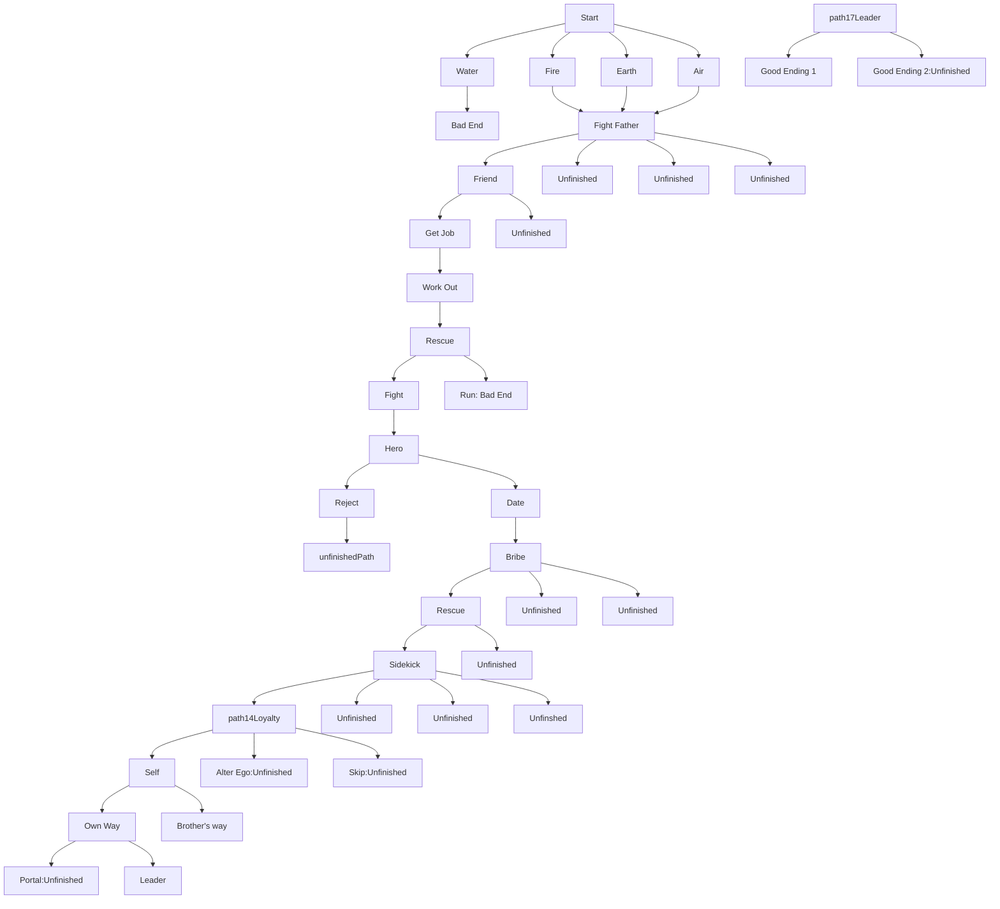

```mermaid
flowchart
    path1[Start]
    
    path1 --> path2Water[Water] --> badpath[Bad End]
    path1 --> path2Fire[Fire] --> path3Fight
    path1 --> path2Earth[Earth] --> path3Fight
    path1 --> path2Air[Air] --> path3Fight
    
    path3Fight[Fight Father]

    path3Fight --> path4Friend[Friend]
    path3Fight --> path4Brother[Unfinished]
    path3Fight --> path4Solo[Unfinished]
    path3Fight --> path4Home[Unfinished]

    path4Friend --> path5Job[Get Job]
    path4Friend --> path5Steal[Unfinished]

    path5Job --> path6Train[Work Out]

    path6Train --> path7Rescue[Rescue]

    path7Rescue --> path8Fight[Fight]
    path7Rescue --> path8Run[Run: Bad End]

    path8Fight --> path9Hero[Hero]

    path9Hero --> path10Date[Date]
    path9Hero --> path10Reject[Reject]

    path10Reject --> unfinishedPath
    path10Date --> path11Bribe[Bribe]

    path11Bribe --> path12Rescue[Rescue]
    path11Bribe --> path12Arrest[Unfinished]
    path11Bribe --> path12Silence[Unfinished]

    path12Rescue[Rescue] --> path13Sidekick[Sidekick]
    path12Rescue --> path13Reject[Unfinished]

    path13Sidekick --> path14Loyalty
    path13Sidekick --> path14Girl3[Unfinished]
    path13Sidekick --> path14Girl4[Unfinished]
    path13Sidekick --> path14All[Unfinshed]

    path14Loyalty --> path15Self[Self]
    path14Loyalty --> path15Hero[Alter Ego:Unfinished]
    path14Loyalty --> path15Skip[Skip:Unfinished]

    path15Self --> path16Hero[Own Way]
    path15Self --> path16Cooperate[Brother's way]

    path16Hero --> path17Portal[Portal:Unfinished]
    path16Hero --> path18Leader[Leader]

    path17Leader --> path18Victory[Good Ending 1]
    path17Leader --> path18Mercy[Good Ending 2:Unfinished]
```