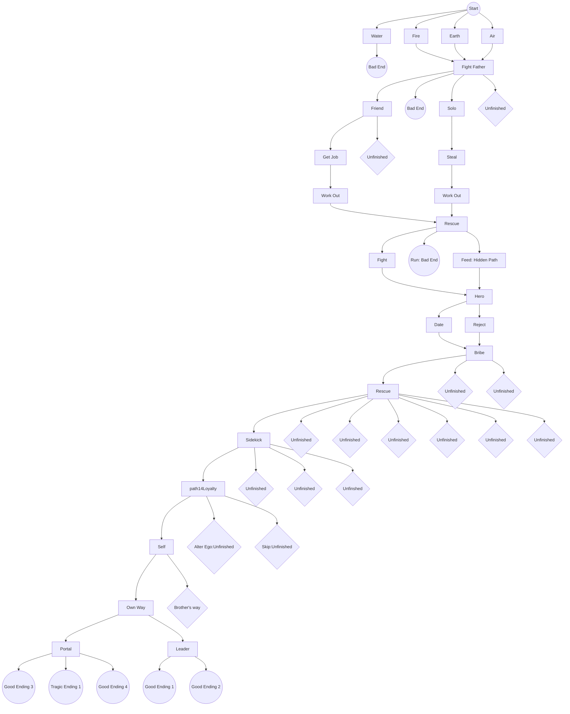

Note, this flowchart does not reflect hidden conditions to reach certain paths.

```mermaid
flowchart
    path1((Start))
    
    path1 --> path2Water[Water] --> badpath((Bad End))
    path1 --> path2Fire[Fire] --> path3Fight
    path1 --> path2Earth[Earth] --> path3Fight
    path1 --> path2Air[Air] --> path3Fight
    
    path3Fight[Fight Father]

    path3Fight --> path4Friend[Friend]
    path3Fight --> path4Brother((Bad End))
    path3Fight --> path4Solo[Solo] --> path5StealSolo[Steal] --> path6TrainDesert[Work Out]
    path3Fight --> path4Home{Unfinished}

    path4Friend --> path5Job[Get Job]
    path4Friend --> path5StealFriend{Unfinished}

    path5Job --> path6TrainOcean[Work Out]

    path6TrainOcean --> path7Rescue[Rescue]
    path6TrainDesert --> path7Rescue

    path7Rescue --> path8Fight[Fight]
    path7Rescue --> path8Run((Run: Bad End))
    path7Rescue --> path8Feed[Feed: Hidden Path]

    path8Fight --> path9Hero[Hero]
    path8Feed --> path9Hero

    path9Hero --> path10Date[Date]
    path9Hero --> path10Reject[Reject]

    path10Reject --> path11Bribe
    path10Date --> path11Bribe[Bribe]

    path11Bribe --> path12Rescue[Rescue]
    path11Bribe --> path12Arrest{Unfinished}
    path11Bribe --> path12Silence{Unfinished}

    path12Rescue[Rescue] --> path13Sidekick[Sidekick]
    path12Rescue --> path13Reject{Unfinished}
    path12Rescue --> path13TreatVillain{Unfinished}
    path12Rescue --> path13TreatHero{Unfinished}
    path12Rescue --> path13TreatAnti{Unfinished}
    path12Rescue --> path13TreatScientist{Unfinished}
    path12Rescue --> path13TreatGirl{Unfinished}


    path13Sidekick --> path14Loyalty
    path13Sidekick --> path14Girl3{Unfinished}
    path13Sidekick --> path14Girl4{Unfinished}
    path13Sidekick --> path14All{Unfinshed}

    path14Loyalty --> path15Self[Self]
    path14Loyalty --> path15Hero{Alter Ego:Unfinished}
    path14Loyalty --> path15Skip{Skip:Unfinished}

    path15Self --> path16Hero[Own Way]
    path15Self --> path16Cooperate{Brother's way}

    path16Hero --> path17Portal[Portal]
    path16Hero --> path17Leader[Leader]

    path17Portal --> path18Reopen((Good Ending 3))
    path17Portal --> path18Run((Tragic Ending 1))
    path17Portal --> path18Close((Good Ending 4))
    path17Leader --> path18Victory((Good Ending 1))
    path17Leader --> path18Mercy((Good Ending 2))
```